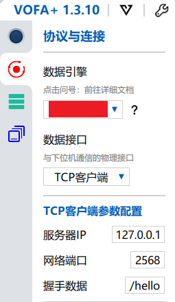

# 我的世界红石线

## 零、仓库简介

本仓库属于 [我的世界红石](https://gitee.com/TiX233/minecraft_redstone_repo) 的一个子部分，用于存储 `红石线` 软件相关的内容  

为便于管理，代码与电路将分别在以下平台开源：  

* 代码：gitee/github
* 电路：

## 一、项目简介

本项目主要基于 PY32F002B 进行实现，通过自己设计的红石通信协议来在一个通信周期为所有红石元件内传递所有红石信号，

所有与 py32 相关的软件工具以及使用手册均可从普冉官网或芯岭技术官网下载到

## 二、烧录

硬件：  
通过 DAP-Link/J-Link/PY-Link 使用 SWD 接口连接电脑与板子

软件：  
一般使用 keil5 或者 puya 官方提供的 CoFlash 版本进行烧录，  
或者使用 openOCD/pyOCD  
详细烧录方法请参考 puya 官方手册  
**对于 keil，SWD 速度不能超过 500K**

## 三、调试

如果需要对本项目进行二次开发，那么可能需要一些调试手段  

为了便于调试以及节约成本，本项目未引出串口，而是使用 Segger RTT 进行指令调试。当然，并不一定需要使用 Segger 的 J-Link，这里使用的是 DAP-Link 与 Vofa+ 进行指令调试

参考内容：  

* [@IOsetting：普冉PY32系列(五) 使用JLink RTT代替串口输出日志](https://www.cnblogs.com/milton/p/17112492.html)
* [@nnnnichijou：Clion中OpenOCD结合SEGGER RTT高速输出调试信息](https://blog.csdn.net/qq_47288055/article/details/143437171)

### 1、连接

* 下载 puya 官方提供的 openocd，并添加到系统环境变量（可能需要安装 cygwin）
* 使用 DAP-Link 通过 swd 接口连接电脑与电路板
* 创建服务端：
  * 在 `git bash` 使用 `sh openocd_rtt2vofa.sh` 命令来创建服务端
  * 如果没有 `git bash`，那么可以使用 `cmd` 输入 `openocd -f rtt2vofa.cfg`
* 打开 `Vofa+`，输入下图配置点击连接即可使用命令进行调试

### 2、调试命令

命令格式同 MC 的指令，使用 `/` 作为开头，例如 `/hello` 命令，  
可以通过 `/help` 命令来查看板子的所有命令以及命令介绍

### 3、自定义命令

可在 `User/Src/cmdProcess.c` 文件中参照其他命令来添加自定义命令以方便调试

### 4、脚本说明

* `pyocd_rtt.sh` ：用来方便用 pyocd 打开 RTT 的一个小脚本
* `rtt2vofa.py` ：用来将 pyocd 的 rtt 输入输出通过 tcp 传输到 vofa+ 的脚本，但是只能输出，不能输入
* `openocd_rtt2vofa.sh` ：使用 openocd 创建 tcp 服务端，vofa+ 连接后可以正常输入输出，关联 `rtt2vofa.cfg`
